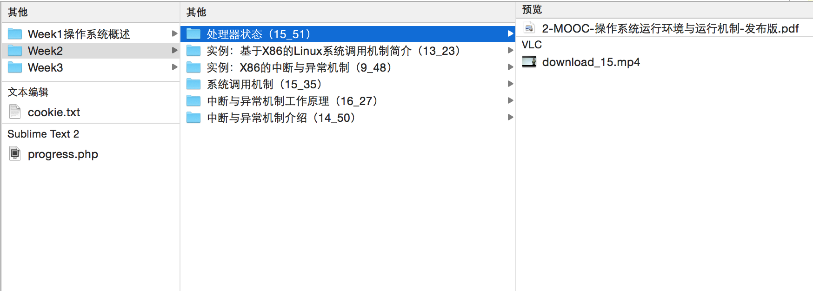

# courseraDownload
A php script used for auto download coursera's videos(and so on) 

一个使用PHP开发的用于批量下载coursera上自己已经参加的课程的视频、PDF等资料命令行处理工具。

有任何意见，欢迎提issue。

## 效果图


## 依赖

* Window
	curl库

* 非Window
	curl库、wget

## 用法

```
php coursera.php "https://class.coursera.org/os-001/lecture" /Users/watson/Downloads/courseraLec
```
* 首先php已经加入到环境变量，如没有请写上php的绝对路径
* 进去到代码下载后的解压目录
* 修改coursera.php文件的第15、17行，改为自己的coursera用户名和密码
* 登录上coursera网站进入你想下载的课程的视频页面（Video Lectures），复制其URL作为该脚本的第一个参数(https://class.coursera.org/os-001/lecture)
* 脚本第二个参数为视频下载路径（绝对路径且目录已经存在）
* 执行后如报“列表获取失败”，请再多试几次（停止命令再次执行）。
* 如果存在文件没下载完全，请再执行，脚本会继续下载。下载成功后会记录到progress.php文件。
* 多次执行时会增量下载，方便在课程还未更新完时每周一更新一下载。
* 目前还不支持专项课程的下载

## 致谢
感谢 coursera网站提供如此丰富且高质量的学习资源。


